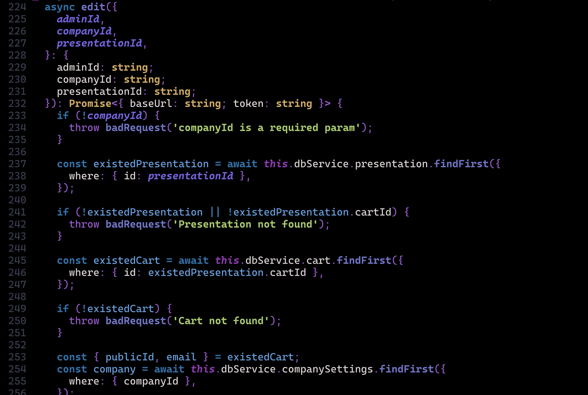
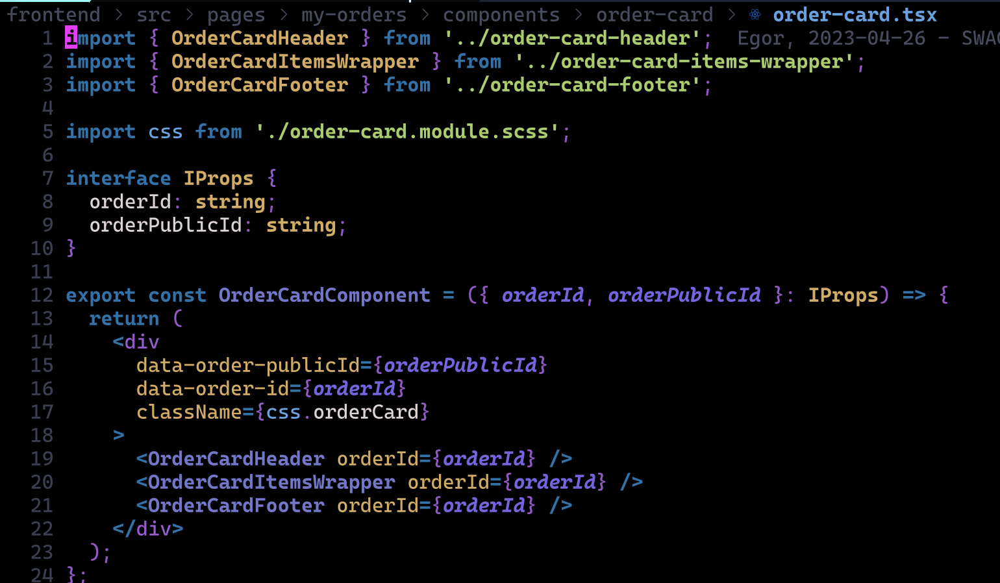
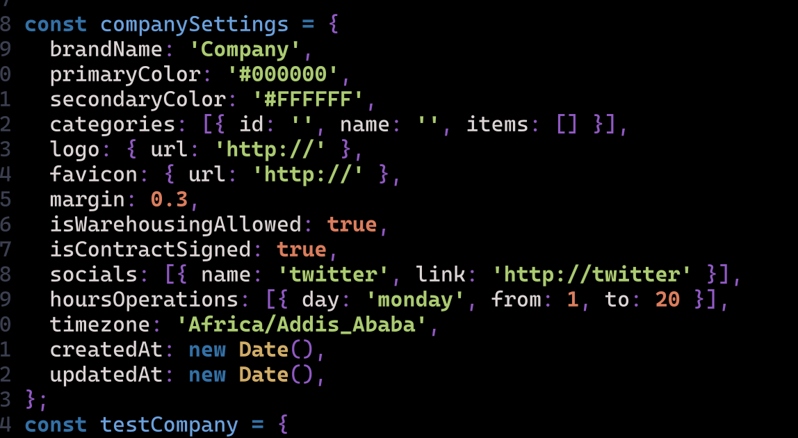

# Black color theme for vim code editor.

### Press the :star: if you like it :)

## Description

Cool dark color theme for vim code editor. 
It is based on material theme. It is a work in progress. 
I will be adding more support for other languages and plugins.


# Installation

## Using packer.nvim

1. Add the following to your config .lua file:

```lua
use('4thwithme/black.nvim');
````

2. Run `:PackerInstall`
3. Add the following to your config .lua file:

```lua
vim.cmd [[colorscheme black]]
```

## Examples:




